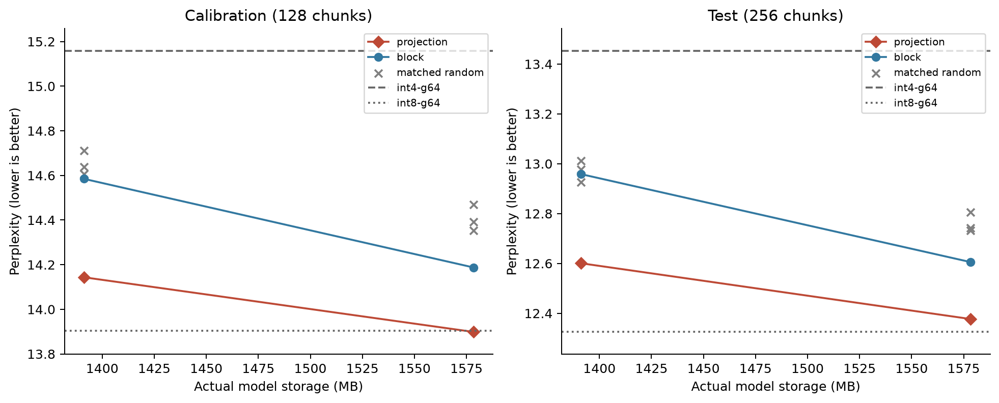

# Mixed-precision quantization on an M3 Pro

I wanted to see whether choosing *which* weights stay at higher precision could
recover most of a model's quality without restoring its full storage footprint.
These experiments use `Qwen/Qwen2.5-1.5B-Instruct`, MLX, and an Apple M3 Pro
with 18 GiB unified memory.

## Choosing where to spend the bits

Uniform int4 saves space, but some weights are more sensitive to quantization than
others. The first approach promoted entire transformer blocks to int8. A finer
approach profiled all **196 layer/projection pairs**, then used a 0/1 knapsack to
choose which projections to promote under an exact storage budget. The remaining
projections stayed at 4 bits; tied embeddings stayed at fp16.

Configuration selection used WikiText-2 validation only: 128 calibration chunks,
with the first 32 used for the projection map. Final quality was measured on 256
held-out test chunks of 512 scored tokens each. The original baselines and selected
whole-block configurations also ran on 500 ARC-Easy questions.

## Better quality at the same size

Projection allocation recovered **95.1%
of the fp16-to-int4 perplexity gap** with **48.9% less model storage than fp16**.
At 1578.36 MB, test perplexity fell from
12.6053 with whole-block promotion to 12.3769.
Lower perplexity is better; fp16 still had the best score.

| Configuration | Model MB | Test perplexity | Decode tokens/s |
| --- | --- | --- | --- |
| fp16 | 3087.43 | 12.3214 | — |
| Uniform int4 | 1204.02 | 13.4525 | 80.92 |
| Uniform int8 | 1859.12 | 12.3252 | 55.74 |
| Block allocation (8) | 1391.19 | 12.9582 | 71.29 |
| Projection allocation (8) | 1391.19 | 12.6006 | 71.58 |
| Block allocation (16) | 1578.36 | 12.6053 | 62.91 |
| Projection allocation (16) | 1578.36 | 12.3769 | 63.62 |

Both budgets match the storage cost of promoting 8 or 16 whole blocks, with group
size 64. Model MB includes quantization metadata and unquantized weights; it isn't
peak runtime memory. Fp16 timing wasn't repeated in this comparison.

Projection allocation beat all three matched random controls at both budgets.
Paired bootstrap intervals also supported the quality improvement over whole-block
allocation. Decode speed was similar: 63.6 versus 62.9 tokens/s
at the larger budget, with overlapping repeat ranges. The gain here was quality at a fixed size.

## Smaller caches and a draft model

**KV-cache quantization.** With `mixed-top-16` weights fixed, the cache tests
covered 512-, 2,048-, and 8,192-token contexts with eight paired continuation windows.
Int8 saved **46.9% of cache storage**, with
0.06–0.91% higher continuation perplexity, but decoding was
7.5–10.5% slower. Int4 cache failed badly here:
perplexity reached 27,906–36,092. An independently dequantized reference
reproduced the failure on calibration data. A smaller cache didn't guarantee lower
total peak memory or faster attention.

**Speculative decoding.** Adding a quantized 0.5B draft model to
`mixed-top-16` gave **1.05–1.33× decode
speedup across three prompts**.
Every greedy output token matched the target-only baseline. The fp16 draft was less
consistent and sometimes slower than no draft.

## Benchmark details and limits

Timing used two warmups and five measured repeats. Projection tests
used three 512-token prompts and 128 generated tokens (90 samples); the cache grid
had 135 timing samples. First-token GPU latency and the next 127 decode steps were
measured separately. The speculative generator used a different timing boundary,
so speed comparisons stay within each experiment. Memory records include actual
array storage, MLX peak allocation, and process RSS.

The projection allocations haven't been tested on ARC-Easy or other corpora.
Thermals and background activity weren't controlled. These results describe one
model on one machine, and the allocation relies on a small calibration sample.
The [raw measurements](results/) and fixed [splits and configurations](data/) are
included; `make report` rebuilds this write-up and the detailed tables locally.
